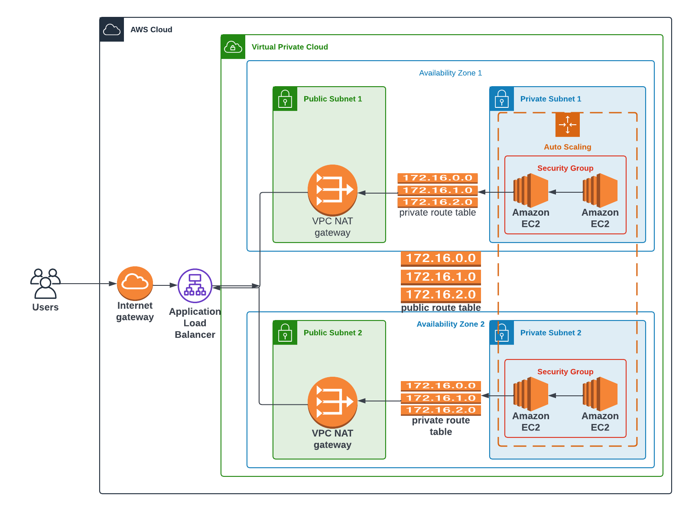

## Project 2: WebServer Deployment with CloudFormation  
  
## Infrastructure Diagram:  
  
  
## How to run the scripts:  
The commands are defined in a `Makefile`.  
  
To create the network stack: 
  
```  
make create_network  
```  
  
To update the network stack: 
  
```  
make update_network  
```  
  
To delete the network stack: 
  
```  
make delete_network  
```  
  
To create the servers stack:  
  
```  
make create_server  
```  
  
To update the servers stack:  
  
```  
make update_server  
```  
  
To delete the server stack:  
  
```  
make delete_server  
```  
  
Load Balancer URL: http://udagr-webap-17tqu1a101tkf-939201576.us-east-1.elb.amazonaws.com